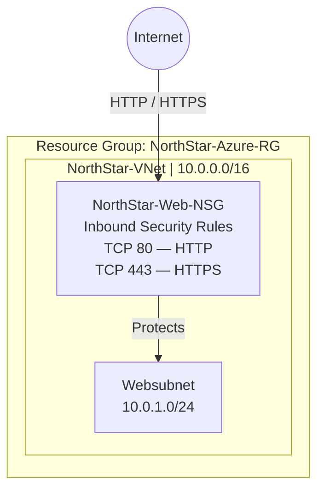

```mermaid
flowchart TB
    INTERNET(("Internet"))

    subgraph RG["Resource Group: NorthStar-Azure-RG"]
        direction TB

        subgraph VNET["NorthStar-VNet | 10.0.0.0/16"]
            direction TB

            NSG["NorthStar-Web-NSG<br/>Inbound Security Rules<br/>TCP 80 — HTTP<br/>TCP 443 — HTTPS"]

            SUBNET["Websubnet<br/>10.0.1.0/24"]

            NSG -->|Protects| SUBNET
        end
    end

    INTERNET -->|"HTTP / HTTPS"| NSG
```
